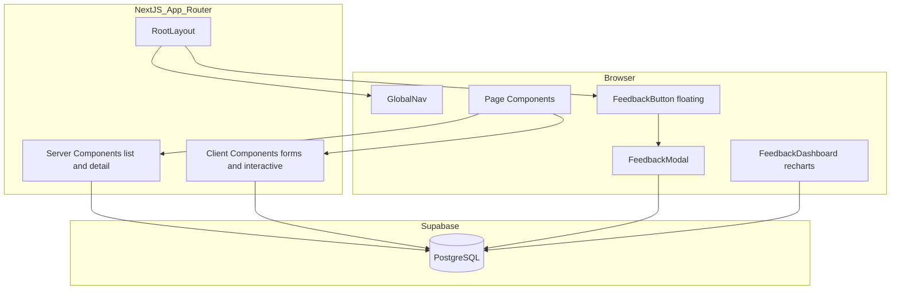
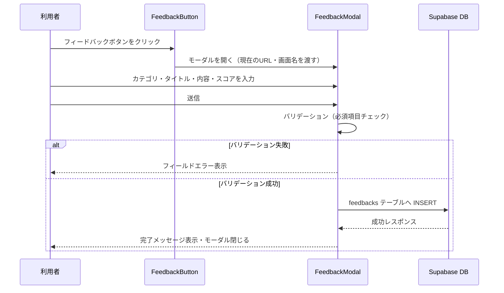
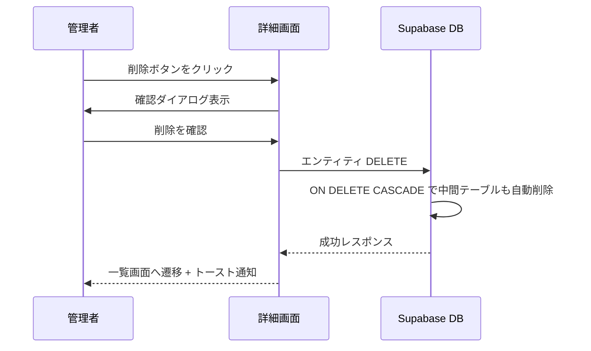
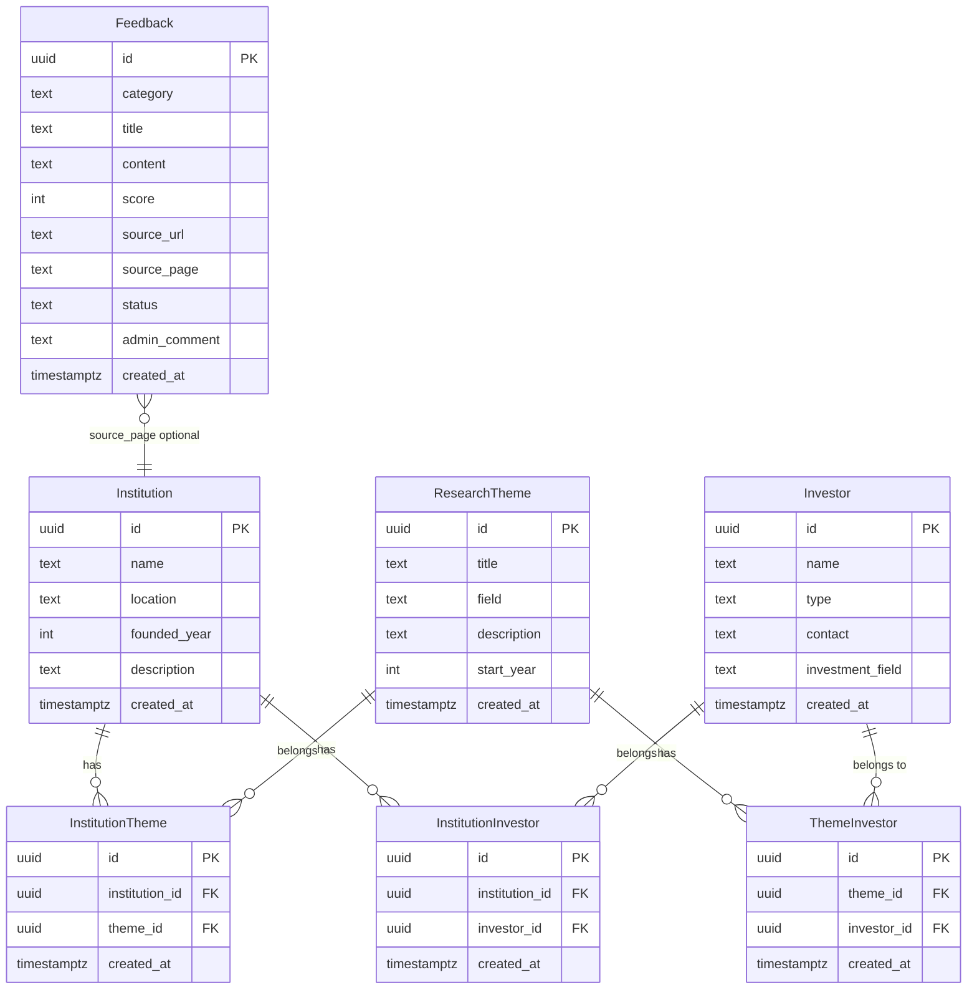
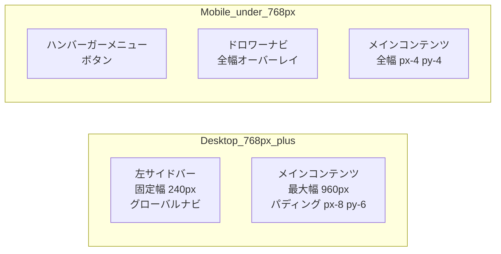

# Design Document: research-management

## Overview

本設計書は、研究機関・研究テーマ・投資家の3エンティティを登録・管理し、エンティティ間の関連付けを行うWebアプリケーションの技術設計を定義する。加えて、利用者フィードバック（コメント・レビュー）の投稿・集計機能を包含する。

**Purpose**: 研究エコシステムの情報を一元管理し、関係者が関連付けの全体像を把握できるようにする。また、利用者からのフィードバックを収集・管理することでアプリ改善サイクルを確立する。

**Users**: アプリ管理者（全CRUD・フィードバック管理）と一般利用者（フィードバック投稿・確認）が利用する。

**Impact**: 既存の Next.js + Supabase スターター（`app/tests/page.tsx` が示すパターン）をベースに、新規ルート群・データモデル・UIコンポーネントを追加する。

### Goals
- 研究機関・研究テーマ・投資家のCRUD操作（要件 1〜3）
- 3エンティティ間の多対多関連付け管理（要件 4）
- キーワード・フィルタ検索（要件 5）
- 全画面からのフィードバック投稿（要件 7）
- フィードバック集計ダッシュボード（要件 8）

### Non-Goals
- ユーザー認証・権限管理（将来課題）
- Supabase RLS によるアクセス制御（将来課題）
- メール通知・外部連携
- CSVエクスポート

---

## Architecture

### Existing Architecture Analysis

既存実装（`app/tests/page.tsx`）が示すパターン：
- `"use client"` コンポーネントで `useEffect` + `useState` + Supabase JS Client を直接呼び出す。
- フォームバリデーションはクライアントサイドのインライン実装。
- スタイルは Tailwind CSS 4.x ユーティリティクラスのみ（設定ファイルなし）。
- `lib/supabase.ts` のシングルトン `supabase` インスタンスを共有。

### Architecture Pattern & Boundary Map

本機能は **Server + Client Component 混在パターン** を採用する。一覧・詳細の初期データ取得を Server Component で行い、フォーム・インタラクションを Client Component に委譲することで初期表示を最適化する。



**Architecture Integration**:
- Server Component がデータ初期フェッチを担当し、props で Client Component へ渡す。
- `FeedbackButton` は `app/layout.tsx` に配置し、全ページで自動表示。
- Supabase クライアントは既存の `lib/supabase.ts` シングルトンを継続使用。

### Technology Stack

| Layer | Choice / Version | Role in Feature | Notes |
|-------|------------------|-----------------|-------|
| Frontend | Next.js 16 + React 19 | App Router によるルーティング・SSR | 既存スタック |
| UI スタイル | Tailwind CSS 4.x | ユーティリティファーストスタイリング | 設定ファイル不要 |
| チャート | Recharts 2.x | フィードバック集計グラフ描画 | Client Component 限定。`npm i recharts` |
| Backend / BaaS | Supabase JS Client 2.x | DB CRUD・型生成 | 既存 `lib/supabase.ts` を継続使用 |
| Data / Storage | Supabase PostgreSQL | 全エンティティ永続化 | 接続先: tyngthitmwazseosvums.supabase.co |
| 言語 | TypeScript 5.x | 全ファイルで厳格型付け | `any` 禁止 |

---

## System Flows

### フィードバック投稿フロー



### エンティティ削除フロー（カスケード）



---

## Requirements Traceability

| Requirement | Summary | Components | Interfaces | Flows |
|-------------|---------|------------|------------|-------|
| 1.1–1.6 | 研究機関CRUD | InstitutionListPage, InstitutionDetailPage, EntityForm | EntityService | — |
| 2.1–2.6 | 研究テーマCRUD | ThemeListPage, ThemeDetailPage, EntityForm | EntityService | — |
| 3.1–3.6 | 投資家CRUD | InvestorListPage, InvestorDetailPage, EntityForm | EntityService | — |
| 4.1–4.6 | 関連付け管理 | AssociationSelector, AssociationCard | AssociationService | 削除フロー |
| 5.1–5.5 | 検索・フィルタ | SearchFilterBar | — | — |
| 6.1–6.5 | ナビ・UI共通 | GlobalNav, Toast, LoadingSpinner | — | — |
| 7.1–7.7 | フィードバック投稿 | FeedbackButton, FeedbackModal, FeedbackListPage | FeedbackService | 投稿フロー |
| 8.1–8.8 | フィードバック集計 | FeedbackDashboard, FeedbackAdminList | FeedbackService | — |

---

## Components and Interfaces

### コンポーネント概要

| Component | Layer | Intent | Req Coverage | Key Dependencies | Contracts |
|-----------|-------|--------|--------------|------------------|-----------|
| GlobalNav | UI / Layout | グローバルナビゲーション | 6.1 | — | State |
| EntityForm | UI / Client | 研究機関・テーマ・投資家の登録・編集フォーム | 1.1, 1.2, 2.1, 2.2, 3.1, 3.2 | EntityService | Service, State |
| EntityListPage | UI / Server | 一覧表示（ページネーション・検索） | 1.3, 2.3, 3.3, 5.1–5.5 | EntityService, SearchFilterBar | Service |
| EntityDetailPage | UI / Server+Client | 詳細・関連付け表示 | 1.4, 2.4, 3.4, 4.6 | EntityService, AssociationService | Service |
| AssociationSelector | UI / Client | 関連付け追加セレクタ | 4.1–4.3, 4.5 | AssociationService | Service |
| SearchFilterBar | UI / Client | キーワード・フィルタ入力 | 5.1–5.5 | — | State |
| FeedbackButton | UI / Client | 全画面フローティングボタン | 7.1 | FeedbackModal | State |
| FeedbackModal | UI / Client | フィードバック投稿フォームモーダル | 7.2–7.6 | FeedbackService | Service, State |
| FeedbackListPage | UI / Client | 投稿者向けフィードバック一覧 | 7.7 | FeedbackService | Service |
| FeedbackDashboard | UI / Client | 集計ダッシュボード（グラフ） | 8.1–8.8 | FeedbackService, Recharts | Service |
| FeedbackAdminList | UI / Client | 管理者向けフィードバック一覧・ステータス更新 | 8.3–8.6 | FeedbackService | Service |
| Toast | UI / Client | トースト通知 | 6.2 | — | State |
| ConfirmDialog | UI / Client | 削除確認ダイアログ | 1.6, 2.6, 3.6, 4.4 | — | State |
| LoadingSpinner | UI | ローディングインジケーター | 6.3 | — | — |
| EntityService | Service | エンティティCRUD操作 | 1–3 | supabase | Service |
| AssociationService | Service | 関連付けCRUD操作 | 4 | supabase | Service |
| FeedbackService | Service | フィードバックCRUD・集計 | 7, 8 | supabase | Service |

---

### Service Layer

#### EntityService

| Field | Detail |
|-------|--------|
| Intent | 研究機関・研究テーマ・投資家の CRUD を Supabase 経由で提供 |
| Requirements | 1.1–1.6, 2.1–2.6, 3.1–3.6 |

**Contracts**: Service [x] / API [ ] / Event [ ] / Batch [ ] / State [ ]

##### Service Interface

```typescript
type EntityTable = "institutions" | "research_themes" | "investors";

interface Institution {
  id: string;
  name: string;
  location: string | null;
  founded_year: number | null;
  description: string | null;
  created_at: string;
}

interface ResearchTheme {
  id: string;
  title: string;
  field: string;
  description: string | null;
  start_year: number | null;
  created_at: string;
}

interface Investor {
  id: string;
  name: string;
  type: "individual" | "corporate";
  contact: string | null;
  investment_field: string | null;
  created_at: string;
}

type Entity = Institution | ResearchTheme | Investor;

interface ListOptions {
  page: number;
  pageSize: number;
  keyword?: string;
  field?: string;        // research_themes 用
  investorType?: "individual" | "corporate"; // investors 用
}

interface PaginatedResult<T> {
  data: T[];
  total: number;
  page: number;
  pageSize: number;
}

interface EntityService {
  list<T extends Entity>(table: EntityTable, options: ListOptions): Promise<PaginatedResult<T>>;
  get<T extends Entity>(table: EntityTable, id: string): Promise<T>;
  create<T extends Entity>(table: EntityTable, input: Omit<T, "id" | "created_at">): Promise<T>;
  update<T extends Entity>(table: EntityTable, id: string, input: Partial<Omit<T, "id" | "created_at">>): Promise<T>;
  remove(table: EntityTable, id: string): Promise<void>;
}
```

- Preconditions: `id` は有効な UUID。`name` / `title` は空文字列不可。
- Postconditions: `create` は新規レコードを返す。`remove` は関連する中間テーブルレコードも CASCADE 削除される。
- Invariants: 全メソッドは Supabase エラーを `ServiceError` 型にラップして throw する。

**Implementation Notes**
- Integration: `lib/supabase.ts` の `supabase` シングルトンを直接使用。
- Validation: 必須フィールドの空チェックはUI層で実施済みのため、Service 層では DB 制約違反のハンドリングに集中。
- Risks: anon key 使用のためクライアントから DB に直接アクセスする構成。RLS 未設定。

---

#### AssociationService

| Field | Detail |
|-------|--------|
| Intent | 3エンティティ間の多対多関連付けCRUD操作 |
| Requirements | 4.1–4.6 |

**Contracts**: Service [x] / API [ ] / Event [ ] / Batch [ ] / State [ ]

##### Service Interface

```typescript
type AssociationTable =
  | "institution_themes"
  | "institution_investors"
  | "theme_investors";

interface InstitutionTheme {
  id: string;
  institution_id: string;
  theme_id: string;
  created_at: string;
}

interface InstitutionInvestor {
  id: string;
  institution_id: string;
  investor_id: string;
  created_at: string;
}

interface ThemeInvestor {
  id: string;
  theme_id: string;
  investor_id: string;
  created_at: string;
}

interface AssociationService {
  listByEntity(
    table: AssociationTable,
    column: string,
    entityId: string
  ): Promise<(InstitutionTheme | InstitutionInvestor | ThemeInvestor)[]>;

  add(
    table: AssociationTable,
    payload: Omit<InstitutionTheme | InstitutionInvestor | ThemeInvestor, "id" | "created_at">
  ): Promise<void>;

  remove(table: AssociationTable, id: string): Promise<void>;
}
```

- Preconditions: 重複チェックは DB の UNIQUE 制約に委譲。アプリ側では 23505 エラーコードを「重複エラー」に変換。
- Postconditions: `remove` は関連付けレコードのみを削除し、本体エンティティには影響しない。

**Implementation Notes**
- Validation: Supabase の PostgreSQL エラーコード `23505`（unique_violation）を検出し、ユーザー向けエラーメッセージを生成。
- Risks: `listByEntity` で大量の関連付けが返る場合の上限を将来的に設定する必要あり。

---

#### FeedbackService

| Field | Detail |
|-------|--------|
| Intent | フィードバック投稿・一覧取得・ステータス更新・集計データ取得 |
| Requirements | 7.1–7.7, 8.1–8.8 |

**Contracts**: Service [x] / API [ ] / Event [ ] / Batch [ ] / State [ ]

##### Service Interface

```typescript
type FeedbackCategory = "improvement" | "bug" | "other";
type FeedbackStatus = "pending" | "in_progress" | "resolved" | "rejected";

interface Feedback {
  id: string;
  category: FeedbackCategory;
  title: string;
  content: string;
  score: number | null;       // 1〜5、任意
  source_url: string;
  source_page: string;
  status: FeedbackStatus;
  admin_comment: string | null;
  created_at: string;
}

interface FeedbackCreateInput {
  category: FeedbackCategory;
  title: string;
  content: string;
  score?: number;
  source_url: string;
  source_page: string;
}

interface FeedbackListOptions {
  category?: FeedbackCategory;
  status?: FeedbackStatus;
  source_page?: string;
  sortBy?: "created_at" | "score";
  sortOrder?: "asc" | "desc";
  page: number;
  pageSize: number;
}

interface FeedbackSummary {
  total: number;
  byCategory: Record<FeedbackCategory, number>;
  byPage: Record<string, number>;
  averageScore: number | null;
}

interface FeedbackService {
  submit(input: FeedbackCreateInput): Promise<Feedback>;
  list(options: FeedbackListOptions): Promise<PaginatedResult<Feedback>>;
  get(id: string): Promise<Feedback>;
  updateStatus(id: string, status: FeedbackStatus, adminComment?: string): Promise<void>;
  getSummary(): Promise<FeedbackSummary>;
}
```

- Preconditions: `category`・`title`・`content` は必須。`score` は 1〜5 の整数のみ。
- Postconditions: `submit` は `source_url` と `source_page` を自動付与して保存。
- Invariants: `getSummary` は `feedbacks` テーブル全件を集計して返す。

**Implementation Notes**
- Integration: `FeedbackButton` が `window.location.pathname` と `document.title` を `source_url`・`source_page` として渡す。
- Validation: スコアの範囲チェック（1〜5）はUIとDB制約（CHECK 制約）の双方で実施。
- Risks: 認証なしのため、悪意ある大量投稿が可能。将来的にレートリミットを導入。

---

### UI Layer

#### FeedbackButton / FeedbackModal

| Field | Detail |
|-------|--------|
| Intent | 全画面右下に固定表示されるフローティングボタンとモーダル投稿フォーム |
| Requirements | 7.1–7.6 |

**Contracts**: Service [x] / API [ ] / Event [ ] / Batch [ ] / State [x]

**Responsibilities & Constraints**
- `app/layout.tsx` に配置し、全ルートで自動レンダリング。
- モーダル開閉状態を `useState` で管理。
- 投稿元情報（URL・画面名）を `usePathname` と `document.title` から取得。
- `z-index: 50` 以上で他要素への重なりを防ぐ。

**State Management**
- State model: `isOpen: boolean`、`formValues: FeedbackFormState`、`submitting: boolean`、`error: string | null`
- Persistence: 投稿完了後にフォームをリセット。

##### Base Props Interface

```typescript
interface FeedbackFormState {
  category: FeedbackCategory | "";
  title: string;
  content: string;
  score: number | null;
}
```

**Implementation Notes**
- Integration: `FeedbackService.submit()` を呼び出し。成功時は Toast 通知を表示。
- Validation: category・title・content の空チェックをサブミット時に実施。
- Risks: `document.title` は SSR 時に空になる可能性 → `useEffect` 内で取得。

---

#### FeedbackDashboard

| Field | Detail |
|-------|--------|
| Intent | フィードバック件数・カテゴリ分布・平均スコアをグラフで可視化するダッシュボード |
| Requirements | 8.1–8.3, 8.7, 8.8 |

**Contracts**: Service [x] / API [ ] / Event [ ] / Batch [ ] / State [x]

**Dependencies**
- Outbound: `FeedbackService.getSummary()` — 集計データ取得 (P0)
- External: Recharts 2.x — BarChart・PieChart (P1)

**Implementation Notes**
- Integration: `"use client"` 必須（Recharts が SSR 非対応）。初期データは `useEffect` で取得。
- Validation: データ0件時は「フィードバックはまだありません」メッセージを表示（要件 8.7）。
- Risks: Recharts のバンドルサイズ（~200KB gzip）が初回ロードに影響する可能性。`next/dynamic` で遅延ロードを検討。

---

#### GlobalNav

| Field | Detail |
|-------|--------|
| Intent | 全画面共通のグローバルナビゲーション |
| Requirements | 6.1 |

**Implementation Notes**
- `app/layout.tsx` にサーバーコンポーネントとして配置。
- リンク先: `/institutions`、`/themes`、`/investors`、`/feedback`、`/admin/feedback`

---

## Data Models

### Domain Model

3つの主要エンティティ（研究機関・研究テーマ・投資家）と3本の中間テーブル、フィードバックエンティティで構成する。



### Physical Data Model

#### institutions テーブル

```sql
CREATE TABLE institutions (
  id           UUID PRIMARY KEY DEFAULT gen_random_uuid(),
  name         TEXT NOT NULL,
  location     TEXT,
  founded_year INT,
  description  TEXT,
  created_at   TIMESTAMPTZ DEFAULT now()
);
CREATE INDEX idx_institutions_name ON institutions (name);
```

#### research_themes テーブル

```sql
CREATE TABLE research_themes (
  id          UUID PRIMARY KEY DEFAULT gen_random_uuid(),
  title       TEXT NOT NULL,
  field       TEXT NOT NULL,
  description TEXT,
  start_year  INT,
  created_at  TIMESTAMPTZ DEFAULT now()
);
CREATE INDEX idx_research_themes_field ON research_themes (field);
```

#### investors テーブル

```sql
CREATE TABLE investors (
  id               UUID PRIMARY KEY DEFAULT gen_random_uuid(),
  name             TEXT NOT NULL,
  type             TEXT NOT NULL CHECK (type IN ('individual', 'corporate')),
  contact          TEXT,
  investment_field TEXT,
  created_at       TIMESTAMPTZ DEFAULT now()
);
CREATE INDEX idx_investors_type ON investors (type);
```

#### 中間テーブル（3本）

```sql
CREATE TABLE institution_themes (
  id             UUID PRIMARY KEY DEFAULT gen_random_uuid(),
  institution_id UUID NOT NULL REFERENCES institutions(id) ON DELETE CASCADE,
  theme_id       UUID NOT NULL REFERENCES research_themes(id) ON DELETE CASCADE,
  created_at     TIMESTAMPTZ DEFAULT now(),
  UNIQUE (institution_id, theme_id)
);

CREATE TABLE institution_investors (
  id             UUID PRIMARY KEY DEFAULT gen_random_uuid(),
  institution_id UUID NOT NULL REFERENCES institutions(id) ON DELETE CASCADE,
  investor_id    UUID NOT NULL REFERENCES investors(id) ON DELETE CASCADE,
  created_at     TIMESTAMPTZ DEFAULT now(),
  UNIQUE (institution_id, investor_id)
);

CREATE TABLE theme_investors (
  id          UUID PRIMARY KEY DEFAULT gen_random_uuid(),
  theme_id    UUID NOT NULL REFERENCES research_themes(id) ON DELETE CASCADE,
  investor_id UUID NOT NULL REFERENCES investors(id) ON DELETE CASCADE,
  created_at  TIMESTAMPTZ DEFAULT now(),
  UNIQUE (theme_id, investor_id)
);
```

#### feedbacks テーブル

```sql
CREATE TABLE feedbacks (
  id            UUID PRIMARY KEY DEFAULT gen_random_uuid(),
  category      TEXT NOT NULL CHECK (category IN ('improvement', 'bug', 'other')),
  title         TEXT NOT NULL,
  content       TEXT NOT NULL,
  score         INT CHECK (score BETWEEN 1 AND 5),
  source_url    TEXT NOT NULL,
  source_page   TEXT NOT NULL,
  status        TEXT NOT NULL DEFAULT 'pending'
                  CHECK (status IN ('pending', 'in_progress', 'resolved', 'rejected')),
  admin_comment TEXT,
  created_at    TIMESTAMPTZ DEFAULT now()
);
CREATE INDEX idx_feedbacks_category ON feedbacks (category);
CREATE INDEX idx_feedbacks_status   ON feedbacks (status);
CREATE INDEX idx_feedbacks_source_page ON feedbacks (source_page);
```

### Data Contracts & Integration

API Data Transfer（Supabase JS Client）：
- 全リクエストは `supabase.from(table).select(...)`／`.insert(...)`／`.update(...)`／`.delete()` 形式。
- レスポンスは `{ data: T | null, error: PostgrestError | null }` の discriminated union。
- 型定義は各 Service Interface の TypeScript 型を使用し、`any` を排除。

---

## ルート構成

| パス | Component | 種別 | 要件 |
|------|-----------|------|------|
| `/institutions` | InstitutionListPage | Server | 1.3, 5.1–5.5 |
| `/institutions/new` | EntityForm (institution) | Client | 1.1, 1.2 |
| `/institutions/[id]` | InstitutionDetailPage | Server+Client | 1.4, 4.1, 4.2, 4.6 |
| `/institutions/[id]/edit` | EntityForm (institution) | Client | 1.5 |
| `/themes` | ThemeListPage | Server | 2.3, 5.1–5.5 |
| `/themes/new` | EntityForm (theme) | Client | 2.1, 2.2 |
| `/themes/[id]` | ThemeDetailPage | Server+Client | 2.4, 4.1, 4.3, 4.6 |
| `/themes/[id]/edit` | EntityForm (theme) | Client | 2.5 |
| `/investors` | InvestorListPage | Server | 3.3, 5.1–5.5 |
| `/investors/new` | EntityForm (investor) | Client | 3.1, 3.2 |
| `/investors/[id]` | InvestorDetailPage | Server+Client | 3.4, 4.2, 4.3, 4.6 |
| `/investors/[id]/edit` | EntityForm (investor) | Client | 3.5 |
| `/feedback` | FeedbackListPage | Client | 7.7 |
| `/admin/feedback` | FeedbackDashboard + FeedbackAdminList | Client | 8.1–8.8 |

---

## Error Handling

### Error Strategy

- **Fail Fast**: フォームのバリデーション（必須・型チェック）をサブミット前にクライアント側で実施。
- **Graceful Degradation**: Supabase 接続失敗時はエラーメッセージと再試行ボタンを表示（要件 6.4）。
- **User Context**: 全エラーメッセージは日本語で具体的な内容を表示する。

### Error Categories and Responses

| カテゴリ | ケース | 対応 |
|---------|--------|------|
| User Errors (4xx相当) | 必須項目未入力 | フィールド横にインラインエラー表示 |
| User Errors (4xx相当) | 重複関連付け（23505） | 「すでに関連付けられています」トースト表示 |
| System Errors (5xx相当) | Supabase 接続失敗 | エラーバナー + 再試行ボタン（要件 6.4） |
| Business Logic (422相当) | スコア範囲外（1〜5以外） | フィールドエラー表示 |

### Monitoring

- Supabase Dashboard のログ機能で DB エラーを確認。
- クライアントコンソールに `console.error` でエラー詳細を出力（開発・学習目的）。

---

## Testing Strategy

### Unit Tests（将来導入: Vitest + Testing Library）

- `EntityService.list()`: ページネーション・フィルタの条件が正しく Supabase クエリに変換されること
- `FeedbackService.submit()`: 必須フィールド欠損時に例外をスローすること
- `AssociationService.add()`: 重複エラー（23505）を `ServiceError` に変換すること
- `FeedbackService.getSummary()`: カテゴリ別件数・平均スコアが正しく集計されること

### Integration Tests

- 研究機関の登録 → 詳細画面で研究テーマを関連付け → 関連付けが表示されること
- 研究機関削除 → 中間テーブルレコードも削除されること（CASCADE 確認）
- フィードバック投稿 → `/admin/feedback` の集計に反映されること

### E2E Tests（将来導入: Playwright）

- 研究機関 CRUD フロー（登録 → 一覧確認 → 編集 → 削除）
- フィードバックボタンをクリック → モーダル表示 → 投稿 → 完了メッセージ確認
- `/admin/feedback` でフィードバック一覧が表示され、ステータス更新が反映されること

---

## Security Considerations

- **Supabase anon key**: クライアントサイドに露出するが Supabase の設計上の想定挙動。本番化時は RLS の設定が必須。
- **XSS**: React の JSX エスケープにより、ユーザー入力の直接 DOM 挿入は発生しない。
- **SQL Injection**: Supabase JS Client のパラメータバインドにより防止される。
- **スパム投稿**: 現フェーズでは未対応。将来的にレートリミットまたは Supabase Auth で対策。

---

## Performance & Scalability

- **ページネーション**: Supabase `.range()` でサーバーサイドページネーションを実装（全件取得を回避）。
- **Recharts 遅延ロード**: `next/dynamic({ ssr: false })` でダッシュボードチャートを遅延ロードし、初回表示を最適化。
- **検索**: Supabase の `ilike` による部分一致検索を使用。データ量が増加した場合は `pg_trgm` インデックスへの移行を検討。

---

## UI/UX Design

> デジタル庁デザインシステム（DADS v2.10.3）を基盤とし、Next.js 16 + Tailwind CSS 4.x で実装する。

### Design Philosophy（設計方針）

**適用ガイドライン**: [デジタル庁デザインシステム（DADS）](https://design.digital.go.jp/dads/)

DADS の中核原則「誰一人取り残されない、人に優しいデジタル化」に基づき、以下の方針を適用する：

| 原則 | 適用方針 |
|------|---------|
| アクセシビリティ優先 | WCAG 2.1 AA 準拠。コントラスト比 4.5:1 以上（テキスト）、3:1 以上（UI要素）を必須とする |
| 行政らしい信頼感 | 装飾を排した情報整理優先のフラットデザイン。プライマリカラーに行政ブルーを使用 |
| 一貫性 | DADS コンポーネント仕様に準拠した命名・スタイル・状態遷移を全画面で統一 |
| レスポンシブ | ブレークポイント768px（モバイル／デスクトップ）の2段階レイアウト |
| フォーカス可視化 | フォーカス時は黄色背景（`#FFD700`相当）＋黒枠でキーボード操作を明示 |

---

### Design Tokens（`app/globals.css` に定義）

Tailwind CSS 4.x の `@theme` ブロックでカスタムトークンを定義する。`tailwind.config.*` は使用しない。

```css
/* app/globals.css */
@import "tailwindcss";

@theme {
  /* ===== カラートークン ===== */

  /* プライマリ（行政ブルー） */
  --color-primary-50:  #E6E8FB;
  --color-primary-100: #C0C5F5;
  --color-primary-200: #8A95EE;
  --color-primary-300: #4F5FE6;
  --color-primary-400: #1A31DC;
  --color-primary-500: #0017C1;  /* ブランドカラー */
  --color-primary-600: #0014A8;
  --color-primary-700: #00108C;
  --color-primary-800: #000C70;
  --color-primary-900: #00084A;

  /* テキスト */
  --color-text-primary:   #1A1A1C;
  --color-text-secondary: #595959;
  --color-text-disabled:  #949494;
  --color-text-on-primary: #FFFFFF;

  /* 背景 */
  --color-surface-default:  #FFFFFF;
  --color-surface-subtle:   #F5F5F5;
  --color-surface-muted:    #EBEBEB;
  --color-surface-overlay:  rgba(0, 0, 0, 0.45);

  /* ボーダー */
  --color-border-default:  #CCCCCC;
  --color-border-strong:   #767676;
  --color-border-focus:    #1A1A1C;

  /* セマンティック */
  --color-success-bg:   #E8F7EE;
  --color-success-text: #006E28;
  --color-success-icon: #00A73C;

  --color-error-bg:   #FDECEA;
  --color-error-text: #B80012;
  --color-error-icon: #E60012;

  --color-warning-bg:   #FFF5E0;
  --color-warning-text: #7A4500;
  --color-warning-icon: #FF9900;

  --color-info-bg:   #E6E8FB;
  --color-info-text: #0017C1;
  --color-info-icon: #0017C1;

  /* フォーカスリング */
  --color-focus-ring-bg:     #FFD700;
  --color-focus-ring-border: #1A1A1C;

  /* ===== タイポグラフィトークン ===== */
  --font-sans:  "Noto Sans JP", "Helvetica Neue", Arial, sans-serif;
  --font-mono:  "Noto Sans Mono", "SFMono-Regular", Consolas, monospace;

  --text-xs:   0.75rem;   /* 12px — 使用禁止（フッター等の例外除く） */
  --text-sm:   0.875rem;  /* 14px — フッター・補足テキスト（最小） */
  --text-base: 1rem;      /* 16px — 本文基準（最小推奨） */
  --text-lg:   1.125rem;  /* 18px */
  --text-xl:   1.25rem;   /* 20px */
  --text-2xl:  1.5rem;    /* 24px */
  --text-3xl:  1.875rem;  /* 30px */
  --text-4xl:  2.25rem;   /* 36px */
  --text-5xl:  3rem;      /* 48px */

  --leading-tight:   1.2;   /* 見出し */
  --leading-snug:    1.3;   /* 管理画面・業務システム */
  --leading-normal:  1.5;   /* 標準 */
  --leading-relaxed: 1.75;  /* 読み物コンテンツ */

  /* ===== スペーシングトークン（8px基準） ===== */
  --spacing-1: 0.25rem;  /* 4px */
  --spacing-2: 0.5rem;   /* 8px  — 最小単位 */
  --spacing-3: 0.75rem;  /* 12px */
  --spacing-4: 1rem;     /* 16px */
  --spacing-6: 1.5rem;   /* 24px */
  --spacing-8: 2rem;     /* 32px */
  --spacing-10: 2.5rem;  /* 40px */
  --spacing-12: 3rem;    /* 48px */
  --spacing-16: 4rem;    /* 64px */

  /* ===== エレベーション（シャドウ）トークン ===== */
  --shadow-0: none;
  --shadow-1: 0 1px 2px rgba(0, 0, 0, 0.08);
  --shadow-2: 0 2px 8px rgba(0, 0, 0, 0.10);
  --shadow-3: 0 4px 16px rgba(0, 0, 0, 0.12);
  --shadow-4: 0 8px 24px rgba(0, 0, 0, 0.14);

  /* ===== 角丸トークン ===== */
  --radius-sm:   0.25rem;  /* 4px  — チップ・バッジ */
  --radius-md:   0.375rem; /* 6px  — ボタン・入力欄 */
  --radius-lg:   0.5rem;   /* 8px  — カード */
  --radius-xl:   0.75rem;  /* 12px — モーダル */
  --radius-full: 9999px;   /* 完全円形 */
}
```

---

### Color Palette

| トークン | 値 | 用途 |
|---------|-----|------|
| `--color-primary-500` | `#0017C1` | ブランドカラー・CTAボタン・アクティブ状態 |
| `--color-text-primary` | `#1A1A1C` | 本文・見出し・ラベル |
| `--color-text-secondary` | `#595959` | 補足テキスト・プレースホルダー |
| `--color-text-disabled` | `#949494` | 無効状態テキスト |
| `--color-surface-default` | `#FFFFFF` | ページ背景・カード背景 |
| `--color-surface-subtle` | `#F5F5F5` | テーブル行ストライプ・入力欄背景 |
| `--color-surface-muted` | `#EBEBEB` | 区切り線・テーブルヘッダー |
| `--color-border-default` | `#CCCCCC` | 入力欄枠・カード枠 |
| `--color-success-icon` | `#00A73C` | 成功アイコン・成功バッジ |
| `--color-error-icon` | `#E60012` | エラーアイコン・エラーテキスト |
| `--color-warning-icon` | `#FF9900` | 警告アイコン |

---

### Typography

**フォント読み込み（`app/layout.tsx`）**:
```typescript
import { Noto_Sans_JP } from "next/font/google";

const notoSansJP = Noto_Sans_JP({
  weight: ["400", "700"],
  subsets: ["latin"],
  variable: "--font-sans",
  display: "swap",
});
```

**テキストスタイル体系**（DADSタイポグラフィスケール準拠）:

| 用途 | クラス例 | サイズ | ウェイト | 行間 |
|------|---------|--------|---------|------|
| ページタイトル (H1) | `text-3xl font-bold` | 30px | 700 | 1.3 |
| セクション見出し (H2) | `text-2xl font-bold` | 24px | 700 | 1.3 |
| カード見出し (H3) | `text-xl font-bold` | 20px | 700 | 1.3 |
| 本文 | `text-base font-normal` | 16px | 400 | 1.75 |
| ラベル・UI補足 | `text-sm font-normal` | 14px | 400 | 1.5 |
| ボタンラベル | `text-base font-bold` | 16px | 700 | 1.0 |

---

### Component Styles

#### ボタン（DADS Button準拠）

DADSの3種類ボタンスタイル + 4サイズをTailwindクラスで実現する。

```typescript
// 基本クラス定義
const buttonBase = [
  "inline-flex items-center justify-center gap-2",
  "font-bold rounded-md transition-colors duration-150",
  "focus-visible:outline-none focus-visible:bg-[#FFD700] focus-visible:ring-2 focus-visible:ring-[#1A1A1C]",
  "disabled:opacity-50 disabled:cursor-not-allowed",
].join(" ");

// 種別
const buttonVariants = {
  // 塗りボタン（プライマリ）
  filled: "bg-[#0017C1] text-white hover:bg-[#0014A8] active:bg-[#00108C]",
  // アウトラインボタン（セカンダリ）
  outline: "border-2 border-[#0017C1] text-[#0017C1] bg-white hover:bg-[#E6E8FB] active:bg-[#C0C5F5]",
  // テキストボタン（ターシャリ）
  text: "text-[#0017C1] underline hover:text-[#0014A8] active:text-[#00108C]",
  // 危険操作（削除）
  danger: "bg-[#E60012] text-white hover:bg-[#B80012] active:bg-[#8C000D]",
};

// サイズ（DADS: Large 56px / Medium 48px / Small 36px / X-Small 28px）
const buttonSizes = {
  lg: "h-14 px-8 text-base min-w-[136px]",    // 56px height
  md: "h-12 px-6 text-base min-w-[96px]",     // 48px height
  sm: "h-9  px-4 text-sm  min-w-[80px]",      // 36px height
  xs: "h-7  px-3 text-sm  min-w-[72px]",      // 28px height
};
```

#### 入力欄（DADS Input準拠）

```typescript
const inputBase = [
  "w-full rounded-md border border-[#CCCCCC] bg-[#F5F5F5]",
  "px-4 py-3 text-base text-[#1A1A1C] leading-normal",
  "placeholder:text-[#949494]",
  "hover:border-[#767676]",
  "focus:outline-none focus:border-[#0017C1] focus:ring-2 focus:ring-[#0017C1]/20 focus:bg-white",
  "disabled:opacity-50 disabled:cursor-not-allowed",
  // エラー状態
  "aria-[invalid=true]:border-[#E60012] aria-[invalid=true]:ring-2 aria-[invalid=true]:ring-[#E60012]/20",
].join(" ");
```

- ラベルは必ず `<label>` 要素で関連付ける（`htmlFor` 属性）。
- 必須項目は `<label>` 末尾に `<span aria-hidden="true" className="text-[#E60012] ml-1">*</span>` を付与。
- エラーメッセージは入力欄の直下に `role="alert"` で表示し、`aria-describedby` で入力欄と紐付ける。

#### テーブル（DADS Table準拠）

```typescript
// テーブル共通スタイル
const tableStyles = {
  wrapper: "w-full overflow-x-auto rounded-lg border border-[#EBEBEB] shadow-[var(--shadow-1)]",
  table: "w-full text-sm border-collapse",
  thead: "bg-[#EBEBEB]",
  th: "px-4 py-3 text-left text-xs font-bold text-[#595959] uppercase tracking-wider border-b border-[#CCCCCC]",
  tbody: "divide-y divide-[#EBEBEB] bg-white",
  tr: "hover:bg-[#F5F5F5] transition-colors duration-100",
  td: "px-4 py-3 text-[#1A1A1C]",
};
```

#### 通知バナー（DADS Notification Banner準拠）

4種類のセマンティックバナー（Color Chipスタイル採用）：

```typescript
const bannerVariants = {
  success: {
    container: "border-l-4 border-l-[#00A73C] bg-[#E8F7EE] text-[#006E28]",
    icon: "text-[#00A73C]",  // CheckCircle アイコン
  },
  error: {
    container: "border-l-4 border-l-[#E60012] bg-[#FDECEA] text-[#B80012]",
    icon: "text-[#E60012]",  // XCircle アイコン
  },
  warning: {
    container: "border-l-4 border-l-[#FF9900] bg-[#FFF5E0] text-[#7A4500]",
    icon: "text-[#FF9900]",  // AlertTriangle アイコン
  },
  info: {
    container: "border-l-4 border-l-[#0017C1] bg-[#E6E8FB] text-[#0017C1]",
    icon: "text-[#0017C1]",  // Info アイコン
  },
};

// バナー構造: アイコン + タイトル + 任意の説明文 + 任意の閉じるボタン
// role="alert" を付与してスクリーンリーダーに即時通知
```

#### モーダル・確認ダイアログ

```typescript
// DADS Elevation Level 3 相当
const modalStyles = {
  overlay: "fixed inset-0 z-50 bg-[rgba(0,0,0,0.45)] flex items-center justify-center p-4",
  panel: "w-full max-w-md rounded-xl bg-white shadow-[var(--shadow-4)] p-6",
  title: "text-xl font-bold text-[#1A1A1C] mb-4",
  actions: "flex justify-end gap-3 mt-6",
};
// ダイアログはtrap focus（aria-modal="true"、Escape キーで閉じる）
// 破壊的操作の確認ボタンには danger バリアントを使用
```

---

### Layout & Grid

**グローバルレイアウト構造**（デスクトップ：左サイドバー + メインコンテンツ）：



**グリッドシステム**（12カラム、8px基準）：

| 用途 | クラス |
|------|--------|
| 2カラムレイアウト（詳細画面） | `grid grid-cols-1 md:grid-cols-2 gap-6` |
| 3カラムカードグリッド | `grid grid-cols-1 md:grid-cols-2 lg:grid-cols-3 gap-4` |
| フォームフィールドグループ | `grid grid-cols-1 md:grid-cols-2 gap-4` |
| 全幅コンテンツ | `max-w-[960px] mx-auto px-8` |

**ブレークポイント**（DADSの1点切替方式）：
- モバイル: `< 768px` — 1カラム、スタック配置
- デスクトップ: `≥ 768px` — サイドバー + コンテンツ2〜3カラム

---

### GlobalNav（サイドバー）

```
┌─────────────────────────────────────────────────────────────────┐
│  🏛️ 研究管理システム                              [フィードバック] │  ← ヘッダー (h-14, bg-primary-500, text-white)
├──────────────┬──────────────────────────────────────────────────┤
│              │                                                  │
│  ナビゲーション │  メインコンテンツ領域                            │
│  (240px固定)  │  (max-w-[960px])                               │
│              │                                                  │
│  🏫 研究機関   │                                                 │
│  🔬 研究テーマ  │                                                 │
│  💼 投資家    │                                                  │
│  ──────────  │                                                  │
│  📊 フィードバック│                                               │
│  管理         │                                                  │
│              │                                                  │
└──────────────┴──────────────────────────────────────────────────┘
```

- アクティブリンク: `bg-[#E6E8FB] text-[#0017C1] font-bold border-l-4 border-[#0017C1]`
- 非アクティブ: `text-[#1A1A1C] hover:bg-[#F5F5F5]`
- モバイル: サイドバーを非表示、ハンバーガーボタンでドロワー表示（`z-40`）

---

### Page-by-Page Design Specifications

#### 一覧画面（例：研究機関一覧）

```
┌─────────────────────────────────────────────────────────┐
│ 研究機関                                   [+ 新規登録]  │  ← H1 + CTAボタン(filled, md)
├──────────────────────────────┬──────────────────────────┤
│ 🔍 キーワード検索             │ 絞り込み: [全て ▼]        │  ← SearchFilterBar
├──────────────────────────────┴──────────────────────────┤
│ ┌──────────────────────────────────────────────────────┐│
│ │ 名称    │ 所在地  │ 設立年  │ 作成日時  │ 操作       ││  ← thead (bg-surface-muted)
│ ├──────────┼─────────┼─────────┼──────────┼────────────┤│
│ │ 〇〇大学 │ 東京都  │ 1950    │ 2026/... │ [詳細][削除]││  ← tbody row (hover: bg-surface-subtle)
│ └──────────────────────────────────────────────────────┘│
│                                                          │
│              [< 前] 1 / 5 [次 >]                         │  ← Pagination
└─────────────────────────────────────────────────────────┘
```

- テーブル行の「詳細」: `outline` ボタン (`xs` サイズ)
- 「削除」: `danger` ボタン (`xs` サイズ) — クリックで確認ダイアログを表示
- 0件時: 「研究機関が登録されていません。新規登録から追加してください。」のエンプティステート表示

#### 登録・編集フォーム画面

```
┌─────────────────────────────────────────────────────────┐
│ 研究機関を登録                                           │  ← H1
├─────────────────────────────────────────────────────────┤
│  名称 *                                                  │
│  ┌──────────────────────────────────────────────────┐   │
│  │ 例：〇〇大学                                      │   │
│  └──────────────────────────────────────────────────┘   │
│  ⚠ 名称は必須です                   ← エラー(text-error)  │
│                                                          │
│  所在地                    設立年                        │
│  ┌─────────────────┐       ┌──────────────┐             │
│  │                 │       │              │             │
│  └─────────────────┘       └──────────────┘             │
│                                                          │
│  概要                                                    │
│  ┌──────────────────────────────────────────────────┐   │
│  │                                                  │   │
│  │                                                  │   │
│  └──────────────────────────────────────────────────┘   │
│                                                          │
│              [キャンセル]           [登録する →]          │  ← outline + filled(md)
└─────────────────────────────────────────────────────────┘
```

- フォーム送信中はボタンを `disabled` + スピナー表示
- 成功時: success 通知バナーを表示後、一覧画面へリダイレクト

#### 詳細画面（エンティティ + 関連付けセクション）

```
┌─────────────────────────────────────────────────────────┐
│ ← 一覧へ戻る                                            │  ← テキストボタン
│ 〇〇大学                        [編集]     [削除]        │  ← H1 + outline/danger(sm)
├──────────────────────────────────────────────────────────┤
│ 所在地: 東京都 ｜ 設立年: 1950年                         │  ← テキスト情報
│ 概要: ...                                                │
├──────────────────────────────────────────────────────────┤
│ 関連する研究テーマ                         [+ 追加]       │  ← H2 + outline(sm)
│ ┌──────────┐ ┌──────────┐                               │  ← AssociationCard
│ │ テーマ名  │ │ テーマ名  │                               │  (bg-surface-subtle, rounded-lg)
│ │ 分野: AI  │ │ 分野: 医療│                               │
│ │      [解除]│ │      [解除]│                              │
│ └──────────┘ └──────────┘                               │
├──────────────────────────────────────────────────────────┤
│ 関連する投資家                             [+ 追加]       │
│ ...                                                      │
└─────────────────────────────────────────────────────────┘
```

#### フィードバックボタン（全画面共通）

```
┌────────────────────────────────────────────────────────────┐
│                          画面コンテンツ                    │
│                                                            │
│                                      ┌──────────────────┐ │
│                                      │ 💬 フィードバック │ │  ← 右下固定 (z-50)
│                                      └──────────────────┘ │  ← filled ボタン (md)
└────────────────────────────────────────────────────────────┘
```

フィードバックモーダル構造：
```
┌──────────────────────────────────────────────────┐
│  フィードバックを送る                        [×]  │  ← タイトル + 閉じるボタン
├──────────────────────────────────────────────────┤
│  カテゴリ *                                       │
│  ○ 改善要望  ○ 不具合報告  ○ その他              │  ← radioグループ
│                                                   │
│  タイトル *                                       │
│  ┌────────────────────────────────────────────┐  │
│  └────────────────────────────────────────────┘  │
│                                                   │
│  内容 *                                           │
│  ┌────────────────────────────────────────────┐  │
│  │                                            │  │
│  └────────────────────────────────────────────┘  │
│                                                   │
│  評価（任意）  ☆ ☆ ☆ ☆ ☆                        │  ← 星評価 (1〜5)
│                                                   │
│  投稿元: /institutions （自動）                    │  ← read-only info text
│                                                   │
│           [キャンセル]      [送信する →]           │
└──────────────────────────────────────────────────┘
```

#### フィードバック集計ダッシュボード

```
┌─────────────────────────────────────────────────────────┐
│ フィードバック管理                       [🔄 更新]       │
├──────────┬──────────────┬───────────────┬───────────────┤
│ 総件数   │ 改善要望     │ 不具合報告    │ 平均スコア    │  ← サマリーカード
│  24件    │  14件        │  7件          │  3.8 ★        │  (shadow-2, rounded-lg)
├──────────┴──────────────┴───────────────┴───────────────┤
│                                                          │
│ カテゴリ別件数            │ 画面別件数                    │  ← グラフエリア
│ ┌─── BarChart ─────┐    │ ┌─── BarChart(横棒) ───────┐  │
│ │                  │    │ │                          │  │
│ └──────────────────┘    │ └──────────────────────────┘  │
├────────────────────────────────────────────────────────-┤
│ フィードバック一覧                                        │
│ フィルタ: [カテゴリ▼] [ステータス▼] [画面名▼]  [検索🔍]  │
│ ┌──────────────────────────────────────────────────┐   │
│ │ タイトル   │ カテゴリ │ 画面   │ ステータス │ 日時 ││  ← データテーブル
│ └──────────────────────────────────────────────────┘   │
└─────────────────────────────────────────────────────────┘
```

グラフ仕様（Recharts）：
- カテゴリ別件数: `BarChart`（縦棒、カテゴリ3本）— バー色: `#0017C1`（改善）/ `#E60012`（不具合）/ `#595959`（その他）
- 画面別件数: `BarChart`（横棒、上位10画面）— バー色: `#0017C1`
- グラフはアクセシブルなテキストサマリーを `aria-label` で提供
- `prefers-reduced-motion` を考慮しアニメーション時間を `isAnimationActive={!prefersReducedMotion}` で制御

---

### Accessibility Requirements（アクセシビリティ要件）

以下は WCAG 2.1 AA 準拠の必須要件として実装する：

| 要件 | 実装方法 |
|------|---------|
| コントラスト比 4.5:1（テキスト） | `--color-text-primary` (#1A1A1C) on white: 17.5:1 ✓ |
| コントラスト比 3:1（UI要素） | `--color-border-default` (#CCCCCC) on white: 使用制限あり。枠線はデータ境界にのみ使用 |
| フォーカス可視化 | `focus-visible:bg-[#FFD700] focus-visible:ring-2 focus-visible:ring-[#1A1A1C]` |
| キーボード操作 | すべてのインタラクション要素を Tab / Enter / Escape で操作可能に |
| スクリーンリーダー | `aria-label`・`aria-describedby`・`role="alert"` を適切に付与 |
| カラーのみに依存しない | エラー・成功・警告にはアイコン（Lucide React）を必ず付与 |
| 見出し階層 | H1（ページタイトル）→ H2（セクション）→ H3（カード/サブセクション）を厳守 |
| タッチターゲット | 最小 44×44px（DADS 準拠）。アイコンボタンは `min-w-[44px] min-h-[44px]` |
| reduced-motion | アニメーション・遷移に `@media (prefers-reduced-motion: reduce)` を適用 |

**アイコンライブラリ**: Lucide React（`lucide-react`）を使用。絵文字をアイコンとして使用しない。

---

### Interaction Patterns

| パターン | 仕様 |
|---------|------|
| ローディング状態 | ボタン内スピナー（`animate-spin`）または Skeleton UI（`animate-pulse`） |
| トースト通知 | 成功・エラー・警告の3種。`aria-live="polite"`。3〜5秒で自動消去 + 手動閉じる |
| ホバー遷移 | `transition-colors duration-150`。`ease-out` |
| ページ遷移 | Next.js App Router のデフォルト。スクロール位置はルート変更時にリセット |
| フォームバリデーション | onBlur でバリデーション実行。エラーは `aria-invalid="true"` + エラーテキスト |
| 削除確認 | `ConfirmDialog`（モーダル）でワンクッション。OKボタンは `danger` バリアント |
| フィードバックボタン位置 | `fixed bottom-6 right-6 z-50`（コンテンツに重ならないよう `pb-20` でオフセット） |
